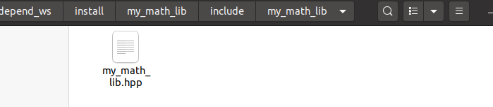
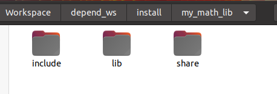

# 如何在ROS2中手写、编译、链接自己的库

# 0 直接说结论

在ROS2的ament编译体系下，自定义生成库文件，及其链接和编译都变得非常容易。直接给出例子：自己写的库文件为`my_math_lib`，而使用这个库的包为`complex_test`。


## 0.1 对于my_math_lib

### CMakeLists.txt

#### 1 添加库

```cmake
# 添加源文件，生成库
add_library(my_math_lib SHARED
        include/my_math_lib/my_math_lib.hpp
        src/my_math_lib.cpp
        )
# 添加头文件地址
target_include_directories(my_math_lib PUBLIC
        $<BUILD_INTERFACE:${CMAKE_CURRENT_SOURCE_DIR}/include>
        $<INSTALL_INTERFACE:include>
        )
```

#### 2 链接依赖

```cmake
# 用于代替传统的target_link_libraries
ament_target_dependencies(my_math_lib
        PUBLIC
        rclcpp
        )
```

#### 3 导出依赖

```cmake
# 为了使下游文件可以访问
ament_export_targets(my_math_lib HAS_LIBRARY_TARGET)
ament_export_dependencies(
        rclcpp
)

# 注册 导出头文件
install(
        DIRECTORY include/
        DESTINATION include
)

# 注册 导出库文件
install(
        TARGETS my_math_lib	# 告诉ros2有这么个目标（可执行文件或者库）
        EXPORT my_math_lib
        ARCHIVE DESTINATION lib
        LIBRARY DESTINATION lib
        RUNTIME DESTINATION bin
        INCLUDES DESTINATION include
)
ament_package()
```

### package.xml

不需要任何额外的东西

```xml
<package format="2">
    <version>0.0.0</version>
    <name>my_math_lib</name>
    <description>my_math_lib</description>
    <maintainer email="renyunfan@outlook.com">Yunfan Ren</maintainer>
    <license>BSD</license>
    <buildtool_depend>ament_cmake</buildtool_depend>
    <export>
        <build_type>ament_cmake</build_type>
    </export>
</package>
```


## 0.2 对于complex_test

### package.xml

一句话添加需要依赖的库

```xml
 <depend>my_math_lib</depend>
```

### CMakeLists.txt

查找库

```cmake
find_package(my_math_lib REQUIRED)
```

生成可执行文件

```cmake
# 查找依赖文件
add_executable(complex_test
        src/complex_test.cpp
        )
```

链接库

```cmake
ament_target_dependencies(complex_test
        my_math_lib
        rclcpp
        )
```

安装可执行文件（没有这一步 ros2 run会找不到）

```cmake
install(TARGETS complex_test
        DESTINATION lib/${PROJECT_NAME})
```


# 1 原理分析

从C语言的角度来看，制作一个库，至少要包含两个部分：

* 制作动态链接库（.so文件）。（或者.a静态链接库）。
* 共享头文件。

那么如何在ament编译系统下完成这些事情呢。

## 1.1 添加编译目标

首先参考文档【1】，我们要添加编译目标（target，通常指可执行文件或者库文件，这里我们的target就是my_math_lib库）。

```cmake
# 添加源文件，生成静态库
add_library(my_math_lib SHARD
        include/my_math_lib/my_math_lib.hpp
        src/my_math_lib.cpp
        )

# （不推荐）或者添加源文件，生成静态库
add_library(my_math_lib STATIC
        include/my_math_lib/my_math_lib.hpp
        src/my_math_lib.cpp
        )
# 用于代替传统的target_link_libraries
ament_target_dependencies(my_math_lib
        PUBLIC
        rclcpp
        )
```

如果CMakeLists中只有这一句话，就会报错

```bash
fatal error: my_math_lib/my_math_lib.hpp: No such file or directory
    5 | #include "my_math_lib/my_math_lib.hpp"
      |          ^~~~~~~~~~~~~~~~~~~~~~~~~~~~~
compilation terminated.
```

## 1.2 共享头文件目录

原因是在源文件中，我们并没有通过相对路径来查找头文件，而我们的库文件还没有将头文件共享出去。所以需要加上头文件地址的共享

```cmake
# 添加头文件地址
target_include_directories(my_math_lib PUBLIC
        $<BUILD_INTERFACE:${CMAKE_CURRENT_SOURCE_DIR}/include>
        $<INSTALL_INTERFACE:include>
        )
```

再次编译就通过了

此时查看install路径下的文件，可以发现


啥也没有。因为我们还没有共享出去。其实这个时候可以通过`include_directories`命令强行相对路径给进去，但是没必要。

## 1.3 注册头文件

于是我们注册导出头文件

```cmake
# 注册 导出头文件
install(
        DIRECTORY include/
        DESTINATION include
)
```




头文件就被共享出来了。

## 1.4 注册库文件

接下来我们注册导出库文件

```cmake
# 注册 导出库文件
install(
        TARGETS my_math_lib
        EXPORT my_math_lib
        ARCHIVE DESTINATION lib
        LIBRARY DESTINATION lib
        RUNTIME DESTINATION bin
        INCLUDES DESTINATION include
)
```



如果编译静态库


如果编译动态库


到这里看似所有的东西都有了

我们加入`complex_test`一起编译，结果

```bash
/home/yunfan/Workspace/depend_ws/src/complex_test/src/complex_test.cpp:7:10: fatal error: my_math_lib/my_math_lib.hpp: No such file or directory
    7 | #include "my_math_lib/my_math_lib.hpp"
      |          ^~~~~~~~~~~~~~~~~~~~~~~~~~~~~
compilation terminated.

```

还是报没有头文件。这是为啥呢，不是都在那了吗。

## 1.5 导出库文件

原因是还需要将编译好的库文件export出去，ament提供了一个非常简单的宏

```cmake
# 为了使下游文件可以访问
# 导出所有头文件和库
ament_export_targets(my_math_lib HAS_LIBRARY_TARGET)
# 导出自己的依赖，这样下游文件使用这个库的时候不需要再链接这个库的依赖
ament_export_dependencies(
        rclcpp
)

```

这样就编译通过了。

# 2 报错分析

## 2.1 找不到头文件

ament还提供了一些不那么好用的宏，例如`ament_export_target`

```cmake
ament_export_include_directories(include)
ament_export_libraries(my_library)
```

也是能用的，只不过他是分开export。如果不用第一行会报错，不用第二行好像没事。

```cmake
fatal error: my_math_lib/my_math_lib.hpp: No such file or directory
    7 | #include "my_math_lib/my_math_lib.hpp"
      |          ^~~~~~~~~~~~~~~~~~~~~~~~~~~~~
compilation terminated.

```


接下来这个报错就比较隐蔽了。在complex test里 如果不用

```cmake
#ament_target_dependencies(complex_test
#        my_math_lib
#        rclcpp
#        )
```

的话，还是会报错找不到头文件。如果你还是习惯使用以前的

```cmake
# 查找依赖文件
add_executable(complex_test
        src/complex_test.cpp
        )

target_link_libraries(complex_test
        my_math_lib
        )
```

妥妥的找不到问题了。因为以前都是用include_directory来找的头文件。

```cmake
catkin_package(
        INCLUDE_DIRS include
        LIBRARIES 
        CATKIN_DEPENDS roscpp rospy std_msgs
        #  DEPENDS system_lib
)

include_directories(
        SYSTEM
        include
        ${catkin_INCLUDE_DIRS}
)
```

所以这招现在不可行了。

除非你头铁

```cmake
include_directories(
        ../../install/my_math_lib/include
)
# 查找依赖文件
add_executable(complex_test
        src/complex_test.cpp
        )

target_link_libraries(complex_test
        my_math_lib
        )
```

自己给填上，那就会出现这个问题

## 2.2 undefined reference

```bash
--- stderr: complex_test 
/usr/bin/ld: cannot find -lmy_math_lib
collect2: error: ld returned 1 exit status
```

是因为你应该这么写

```cp
target_link_libraries(complex_test
        ${my_math_lib_LIBRARIES}
        )
```

以前有`${catkin_LIBRARIES}`帮你填了。


但是如果你按照ament的规范来，就不会出这些问题了。

## 2.3 No executable found

使用ros2 run的时候找不到头文件，是因为现在和ros1不一样了。你必须要将可执行文件注册，ros2命令才找得到。因此cmake里的这句完全是必要的。

```cmake
install(TARGETS complex_test
        DESTINATION lib/${PROJECT_NAME})

```

总结一下就是，新的ament真好用，请完全按照新的规范来，如果你要新老混杂的话，就会很痛苦。


这个报错就是因为没有注册导出文件

```cmake
# 注册 导出库文件
install(
        TARGETS my_math_lib
        EXPORT my_math_lib
        ARCHIVE DESTINATION lib
        LIBRARY DESTINATION lib
        RUNTIME DESTINATION bin
        INCLUDES DESTINATION include
)
```

```bash
CMake Error at /home/yunfan/Workspace/depend_ws/install/my_math_lib/share/my_math_lib/cmake/ament_cmake_export_libraries-extras.cmake:48 (message):
  Package 'my_math_lib' exports the library 'my_math_lib' which couldn't be
  found
Call Stack (most recent call first):
  /home/yunfan/Workspace/depend_ws/install/my_math_lib/share/my_math_lib/cmake/my_math_libConfig.cmake:41 (include)
  CMakeLists.txt:19 (find_package)

```


# 3 其他

笔者在clion开发代码习惯了。以前的catkin工作空间中，src下面会有一个大的CMakeLists，用clion load它就可以找到所有被编译到build和devel里的库文件和头文件了。但是新的ament并没有这个东西。导致在clion里，`find_package`找不到对应的库。

```cmake
CMake Error at CMakeLists.txt:19 (find_package):
  By not providing "Findmy_math_lib.cmake" in CMAKE_MODULE_PATH this project
  has asked CMake to find a package configuration file provided by
  "my_math_lib", but CMake did not find one.

  Could not find a package configuration file provided by "my_math_lib" with
  any of the following names:

    my_math_libConfig.cmake
```

这咋办呢，肯定是去看看`find_package`的原理啊。

其实所有的库文件和头文件都已经编译到install里了，CMake进去找一下就能找到了。

find_package的官方文档中是这样说的：

CMake constructs a set of possible installation prefixes for the package. Under each prefix several directories are searched for a configuration file. The tables below show the directories searched. Each entry is meant for installation trees following Windows (W), UNIX (U), or Apple (A) conventions:

```
<prefix>/                                               (W)
<prefix>/(cmake|CMake)/                                 (W)
<prefix>/<name>*/                                       (W)
<prefix>/<name>*/(cmake|CMake)/                         (W)
<prefix>/(lib/<arch>|lib|share)/cmake/<name>*/          (U)
<prefix>/(lib/<arch>|lib|share)/<name>*/                (U)
<prefix>/(lib/<arch>|lib|share)/<name>*/(cmake|CMake)/  (U)
```

也就是`<prefix>`前缀下，只要你按照倒三行的格式排布你的库和头文件，我都能找。

打开install文件夹一看，ament果然讲道理


就是在share下面按照文件组织的。那就简单了，只需要告诉CMAKE在那个prefix下面找就行了。

```cmake
set(CMAKE_PREFIX_PATH ../../install)
```

好了，又可以在Clion里快乐的写代码了。

# 参考资料

* https://cmake.org/cmake/help/v3.2/command/find_package.html#command:find_package
* https://docs.ros.org/en/foxy/How-To-Guides/Ament-CMake-Documentation.html#adding-dependencies

